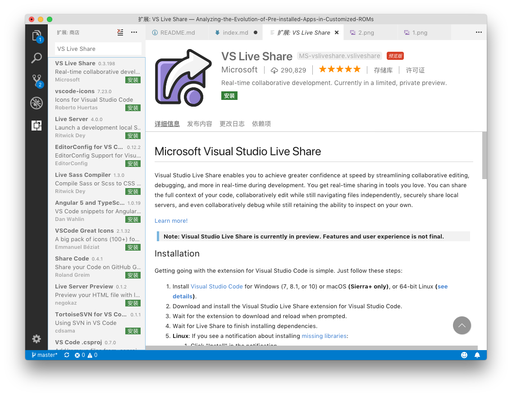

# 关于使用 Latex 及协作编写文档的介绍

杨林青

使用 Latex 可以像编写代码一样编写文档。文档的样式完全由专门的样式文件定义，用户只需编写文档内容即可。使用 Latex 可以很方便的编写数学公式、管理参考文献引用。本文描述了使用文本编辑器 VS Code 实时协同编写文档以及最小安装 Latex 的发行版的方法。

VisualStudio Live Share 可以[实时编辑](https://www.visualstudio.com/zh-hans/services/live-share)文本文档（Latex 源代码）和共享一个终端，因此只需一个人部署了 Latex 编译环境，其他人就可以通过共享的终端来编译 Latex 源代码。由于我的 VS Code 已经安装了 Latex 插件，保存 Latex 源代码即会自动编译生成 PDF 文档。多数情况下只需连接到我的 VS Live Share 中编写代码即可。

## 使用 VS Live Share 协作编写文档

1、下载安装 VisualStudio Code

访问 [VisualStudio Code 网站](https://code.visualstudio.com)，下载并安装 VisualStudio Code。


2、安装中文语言包

打开 VS Code，进入“插件”栏，搜索中文语言包并安装。


3、安装 VS Live Share

搜索 VS Live Share 插件，安装。



安装完成后点击“重新加载”，状态栏会出现安装 VS Live Share 的提示，等待其完成即可。

4、登陆账号

VS Live Share 可以使用微软账号或者 GitHub 账号登陆。登陆的作用时标记用户的名字。在局域网内，同步数据是直接使用局域网传输的，并且只有我的 VS Code 启动时才可以进行实时共享。


点击登陆，在打开的浏览器里登陆，登陆成功并授权后关闭浏览器即可。此时状态栏会显示登陆的用户名：


5、接受邀请并编辑

我会在群里发送实时共享的连接，使用 Edge/IE/Safari/Chrome 访问后会弹出启动 VS Code 的请求。允许后即可参与编辑。


## 最小化部署 Latex 环境

1、访问 [Latex 发行版下载页面](https://www.latex-project.org/get/)，选择对应的系统环境。


对于 Windows，安装 TexLive。对于 macOS，安装 [MacTex](http://www.tug.org/mactex/index.html) 的 [BasicTex](http://www.tug.org/mactex/morepackages.html) 包。安装完成后应当可以在命令行中运行
```
xelatex --help
```
并产生提示。XeLaTex 是支持 UTF-8 编码的 Latex，编写中文文档需要使用它来编译。

2、编译文档

运行
```
xelatex file.tex
```
会生成`file.pdf`文件。在文件中指定使用
```
\usepackage{fontspec}
\setmainfont{PingFangSC-Regular}
```
即可使用电脑中安装的中文字体。其中`PingFangSC-Regular`是安装在我的电脑中的苹方字体。

## 其他参考资料

[1、The LaTeX Project](https://www.latex-project.org)

[2、An introduction to LaTeX](https://www.latex-project.org/about/)

[3、VisualStudio Code](https://code.visualstudio.com) 请在此寻找关于 VS Code 的使用方法。

