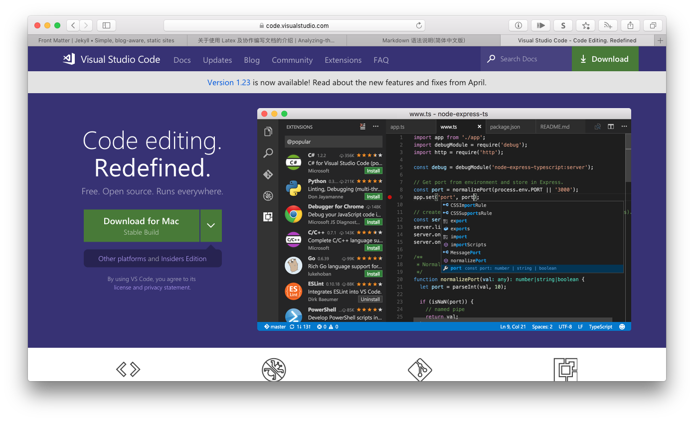

# 关于使用 Latex 及协作编写文档的介绍

杨林青

使用 Latex 可以像编写代码一样编写文档。文档的样式完全由专门的样式文件定义，用户只需编写文档内容即可。使用 Latex 可以很方便的编写数学公式、管理参考文献引用。本文描述了使用文本编辑器 VS Code 实时协同编写文档以及最小安装 Latex 的发行版的方法。

VisualStudio Live Share 可以实时编辑文本文档（Latex 源代码）和共享一个终端，因此只需一个人部署了 Latex 编译环境，其他人就可以通过共享的终端来编译 Latex 源代码。由于

## 使用 VS Live Share 协作编写文档

